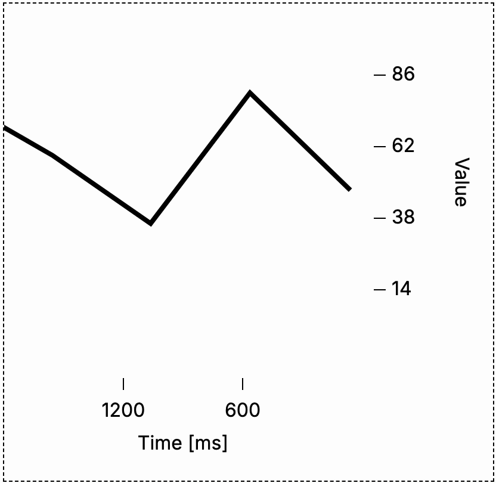

# realgraph

Realtime graph data visualization library for React

<b>Demo:</b> [realgraph.vercel.app](https://realgraph.vercel.app/)

<b>Demo GitHub:</b>
[github.com/peterbasar/realgraph-demo](https://github.com/peterbasar/realgraph-demo)

[Package size](https://bundlephobia.com/package/realgraph):
`28.6 kB Minified 7.2 kB Minified + Gzippedz`


## Table of contents

<!--ts-->

- [Features](#features)
- [Installation](#installation)
- [Usage](#usage)
  - [Props](#props)
  - [Basic example](#basic-example)
  - [Sine function](#sine-function)
  - [Using own list of points](#using-own-list-of-points)
  - [Adding points to internal Graph list of points](#adding-points-to-internal-Graph-list-of-points)
  - [Export options](#export-options)
- [Missing features](#missing-features)
- [Known bugs](#known-bugs)
<!--te-->

## Features

- Plot line graph using
  - your own array of points
  - internal points storage
  - callback value function (adds points in intervals)
- Customize CSS styling of any HTML elements of the package to suit your style by providing `style`
  object as parameter with appropriate HTML element ID, see `GraphStyleI` in
  [/src/components/types.ts](./src/components/types.ts)
- Pause callback function
- Export options
  - CSV
  - SVG (visible or full)
  - Points array
  - Access to internal variables

## Installation

[npm package](https://www.npmjs.com/package/realgraph)

```
npm install realgraph
```

## Usage

### Props

- Types: [src/components/types.ts](./src/components/types.ts)
- Default values:
  [src/components/Graph/GraphDefaultProps.ts](./src/components/Graph/GraphDefaultProps.ts)

```jsx
export interface GraphI {
  points?: pointsI
  width?: widthI
  height?: heightI
  interval?: intervalI
  count?: countI
  memory?: memoryI
  min?: minI
  max?: maxI
  style?: GraphStyleI
  isCallback?: isCallbackI
  getValueCallback?: getValueCallbackI
  active?: boolean
  formatCursorX?: formatCursorXI
  formatCursorY?: formatCursorYI
  axisEnableX?: axisEnableXI
  axisEnableY?: axisEnableYI
  axisHeightX?: axisHeightXI
  axisWidthY?: axisWidthYI
  axisTitleX?: axisTitleXI
  axisTitleY?: axisTitleYI
  axisXSectionCount?: axisSectionCountI
  axisYSectionCount?: axisSectionCountI
  formatAxisX?: formatAxisXI
  formatAxisY?: formatAxisYI
  axisPositionX?: axisPositionXI
  axisPositionY?: axisPositionYI
  isGraphMoving?: isGraphMovingI
  graphMovingRate?: graphMovingRateI
}
```

- `points?: Array<{ x: number y: number }>`:
  - List of points where `x` represents Unix time and `y` value on the graph
  - Use when you want to use your [own custom list of points](#using-own-list-of-points)
    - Pair with `isCallback={false}` and `isGraphMoving={true}`
- `width?: number`
  - Graph width (excluding width of Y axis)
- `height?: number`
  - Graph height (excluding height of X axis)
- `interval?: number`
  - Delay for calling callback function in `[ms]`
- `count?: number`
  - How many points are visible in the graph
- `memory?: number`
  - Maximum size of the array of points being stored and plotted withing the graph
- `min?: number`
  - Minimum value shown in the graph
- `max?: number`
  - Maximum value shown in the graph
- `style?: GraphStyleI`
  - Object of IDs to which user can assign CSS and other element properties
  - See `GraphStyleI` in [/src/components/types.ts](./src/components/types.ts)
- `isCallback?: boolean`
  - Whether callback function should be called each `interval [ms]`
- `getValueCallback?: () => number`
  - Callback function
- `active?: boolean`
  - When `false`, graph will show last point to the right and any additional rendering will not
    update X axis position of these points, only adding new points will move the graph to the left
  - When `true`, points on the graph that were re-rendered will be correctly position on the X axis
- `formatCursorX?: (value: number) => string | number`
  - Function for formatting cursor X axis value
- `formatCursorY?: (value: number) => string | number`
  - Function for formatting cursor Y axis value
- `axisEnableX?: boolean`
  - Whether to turn on X axis
- `axisEnableY?: boolean`
  - Whether to turn on Y axis
- `axisHeightX?: number`
  - Height of X axis
- `axisWidthY?: number`
  - width of Y axis
- `axisTitleX?: string`
  - X axis title
- `axisTitleY?: string`
  - Y axis title
- `axisXSectionCount?: number`
  - Number of sections on the X axis
- `axisYSectionCount?: number`
  - Number of sections on the Y axis
- `formatAxisX?: (value: number) => number | string`
  - Function for formatting values shown on X axis
- `formatAxisY?: (value: number) => number | string`
  - Function for formatting values shown on Y axis
- `axisPositionX?: 'TOP' | 'BOTTOM'`
  - Whether to show X axis on the top or the bottom side of the graph
- `axisPositionY?: 'LEFT' | 'RIGHT'`
  - Whether to show Y axis on the left or the right side of the graph
- `isGraphMoving?: boolean`
  - Whether to rerender the points in the Graph with `graphMovingRate [Hz]` rate
- `graphMovingRate?: number`
  - Value in `Hertz [Hz]` representing how often to re-render points in the graph

### Basic example

```jsx
import Graph from 'realgraph'

function Example() {
  return (
    <Graph
      width={500} // Manually set graph width (excluding axis)
      height={500} // Manually set graph height (excluding axis)
    />
  )
}
```


---

### Sine function

```jsx
import Graph from 'realgraph'

function Example() {
  return (
    <Graph
      max={1.1} // Maximum value in a graph
      min={-1.1} // Minimum value in a graph
      count={50} // Number of points in a graph at a time
      interval={100} // Delay between callbacks in milliseconds
      interval={100} // Delay between callbacks in milliseconds
      axisXSectionCount={1} // Number of sections on X axis
      axisYSectionCount={6} // Number of sections on Y axis
      width={width} // Manually set graph width
      height={height} // Manually set graph height
      getValueCallback={() => {
        return Math.sin(Date.now() / 1000)
      }}
    />
  )
}
```


---

### Using own list of points

```jsx
import { useEffect, useState } from 'react'
import Graph from 'realgraph'

function Example() {
  // Default points
  const [points, setPoints] = useState([
    { x: Date.now() - 1200, y: 10 },
    { x: Date.now() - 700, y: 30 },
    { x: Date.now() - 300, y: 80 },
  ])

  // Adding new points in intervals
  useEffect(() => {
    const intervalId = setInterval(() => {
      setPoints([
        ...points,
        {
          x: Date.now(),
          y: 100 * Math.random(),
        },
      ])
    }, 500)
    return () => {
      clearInterval(intervalId)
    }
  })

  return (
    <RealGraph
      points={points} // Provide points to Graph
      isCallback={false} // Do not call callbacking function
      isGraphMoving={true} // Graph moves in realtime
      max={110} // Maximum value in a graph
      min={-10} // Minumum value in a graph
    />
  )
}
```


---

### Adding points to internal Graph list of points

```jsx
import { useEffect, useRef, ForwardedRef } from 'react'
import Graph from 'realgraph'

function Example() {
  // Define ref
  const ref: ForwardedRef<graphExportRefI | null> = useRef(null)

  // Adding new points in intervals
  useEffect(() => {
    const intervalId = setInterval(() => {
      if (ref && ref.current) {
        ref.current.addPoint(100 * Math.random())
      }
    }, 500)

    return () => {
      clearInterval(intervalId)
    }
  })

  return (
    <RealGraph
      ref={ref} // Pass your ref and get access to additional functions
      isCallback={false} // Do not call callbacking function
      isGraphMoving={true} // Graph moves in realtime
      max={110} // Maximum value in a graph
      min={-10} // Minumum value in a graph
    />
  )
}
```



---

### Export options

```jsx
import { useRef, ForwardedRef } from 'react'
import Graph from 'realgraph'

function Example() {
  const ref: ForwardedRef<graphExportRefI | null> = useRef(null)

  return (
    <>
      <Graph
        ref={ref}
        width={width} // Manually set graph width
        height={height} // Manually set graph height
      />

      <button
        onClick={() => {
          if (ref && ref.current) console.log('points', ref.current.getPoints())
        }}
      >
        Console log points
      </button>

      <button
        onClick={() => {
          if (ref && ref.current) ref.current.downloadCsv()
        }}
      >
        Download CSV
      </button>

      <button
        onClick={() => {
          if (ref && ref.current) ref.current.downloadSvg()
        }}
      >
        Visible graph SVG
      </button>

      <button
        onClick={() => {
          if (ref && ref.current) ref.current.downloadSvgFull()
        }}
      >
        Full graph SVG
      </button>
    </>
  )
}
```

## Missing features

- Make the Graph component automatically resizable to fit the parent element
- Optional offset parameter
- Slider option to check the history
- Point graph option
- Add tests
- Documentation with git integration
- Handling multiple lines in 1 graph

## Known bugs

- Graph slows down on inactive tab (energy saving browser feature)
